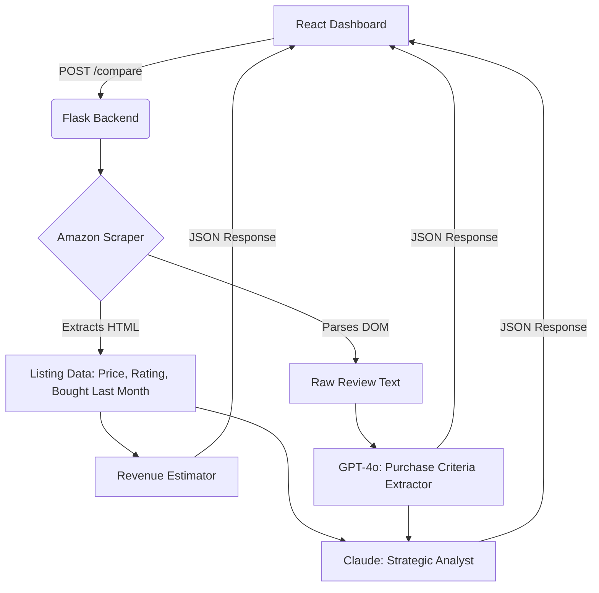

<div align="center">
  
  <h1>Amazon Competitor Intelligence Suite</h1>
  <p><b>AI-powered market research, revenue estimation, and review analytics for Amazon sellers.</b></p>

  [](https://reactjs.org/)
  [](https://flask.palletsprojects.com/)
  [](https://openai.com/)
  [](https://anthropic.com/)
</div>

<br/>

## 🎯 What is this?
Instead of manually reading thousands of reviews and guessing competitor sales, this tool automates Amazon market research. You provide your product URL and up to 9 competitor URLs. The suite scrapes the listings, extracts the reviews, and uses LLMs to tell you exactly:
1. **Who is making the most money** (Revenue Estimation)
2. **What customers actually care about** (Purchase Criteria Extraction)
3. **How to beat them** (Strategic Market Gap Analysis)

---

## ✨ Key Features
- **Primary: Amazon Competitor Analysis:** Add up to 10 ASINs to rank revenue, identify purchase criteria gaps, and get GPT/Claude strategy recommendations.
- **Secondary: Multi-Platform Single Product Mode:** Scrape and analyze single-product reviews from non-Amazon platforms (Google Play, Steam, Trustpilot, App Store, Flipkart) to generate unified sentiment and revenue-opportunity insights.
- 🛡️ **Anti-Bot Resilient Scraper:** Bypasses Amazon CAPTCHAs by extracting top reviews directly from the `/dp/ASIN` DOM.
- 💰 **Data-Driven Revenue Modeling:** Uses Amazon's "bought last month" badges combined with price and rating-penalty heuristics to estimate monthly revenue.
- 🧠 **Dual-LLM Engine:** Uses **GPT-4o-mini** for structured data extraction (purchase criteria) and **Claude 3 Haiku** for critical, contrarian market strategy.
- 📊 **Dynamic Glassmorphism UI:** Built with Framer Motion and Recharts for a premium, animated user experience.

---

## 📸 Sample Output

### 1. Ranked Competitor Comparison
The system automatically sorts competitors by estimated monthly revenue, highlights your listing, and assigns confidence scores.

| Rank | Product | Price | Rating | Reviews | Monthly Units | Monthly Revenue |
| :---: | :--- | :---: | :---: | :---: | :---: | :---: |
| 🥇 | **LG 27GS60QC-B 27" QHD Monitor** | ₹17,999 | 4.3 ⭐ | 1,240 | 1,000 | ₹17,999,000 |
| 🥈 | **BenQ GW2790Q 27" 2K Monitor** | ₹15,250 | 4.3 ⭐ | 648 | 500 | ₹7,625,000 |
| 🥉 | **★ YOUR LISTING (LG 27U631A)** | ₹14,999 | 4.4 ⭐ | 276 | 300 | ₹4,499,700 |

### 2. Extracted Purchase Criteria
Identifies exact triggers driving purchases and flags market gaps (features customers want but competitors lack).

* 🟢 **Display Quality:** 42 mentions *(Strong positive signal)*
* 🟢 **Refresh Rate (100Hz):** 28 mentions *(Strong positive signal)*
* 🔴 **Stand / Ergonomics:** 15 mentions *(Pain point / complaint)*
* 🟡 **Built-in Speakers:** 12 mentions ***(GAP OPPORTUNITY - Customers actively seeking this)***

### 3. AI Market Strategist (Sample Insight)
> *"Your LG listing is priced highly competitively at ₹14,999, but you are losing ₹13M+ in monthly revenue to the LG 27GS60QC-B. The reviews indicate buyers are willing to pay a ₹3,000 premium for a higher refresh rate and better stand ergonomics. **Strategic Move:** Bundle a VESA mount or explicitly highlight color-accuracy for productivity to capture the non-gaming demographic."*

---

## 🛠️ Architecture


---

## 🚀 Local Setup

### Prerequisites
- Node.js (v18+)
- Python (3.10+)
- OpenAI API Key
- Anthropic API Key

### 1. Backend Setup
```bash
cd backend
python3 -m venv venv
source venv/bin/activate
pip install -r requirements.txt
```

Create a `.env` file in the `backend/` directory:
```env
OPENAI_API_KEY=sk-your-openai-key
ANTHROPIC_API_KEY=sk-your-anthropic-key
```

Run the Flask server:
```bash
python3 app.py
```
*Server runs on http://localhost:5000*

### 2. Frontend Setup
```bash
cd frontend
npm install
npm start
```
*App runs on http://localhost:3000*

---

## 💡 Usage Instructions

### Primary Mode: Amazon Competitor Analysis
1. Open the Dashboard at `http://localhost:3000`.
2. Toggle to **"Amazon Competitor Analysis"** mode.
3. Paste **Your Amazon URL** (e.g., `https://www.amazon.in/dp/B0F5HNQ3N1`).
4. Click **+ Add Competitor** to paste up to 9 competing product URLs.
5. Click **Run Competitor Analysis**.
6. Wait 15-30 seconds as the backend scrapes the DOMs and parallelizes the LLM requests.
7. Review your revenue rankings and strategic insights!

### Secondary Mode: Multi-Platform Single Product
1. Toggle to **"Single Product"** mode on the Dashboard.
2. Paste any valid URL from Trustpilot, Google Play, Steam, App Store, or Flipkart.
3. Hit `⌘ + Enter` to extract reviews and generate sentiment and revenue insights for that specific app or product.

---

## ⚠️ Disclaimer
This tool uses standard web requests to parse public DOM data. It does not bypass CAPTCHAs maliciously and relies on the naturally embedded top-reviews on standard `/dp/ASIN` pages to respect platform rate limits.

---
<div align="center">
  <i>Built with ❤️ for Pixii</i>
</div>
